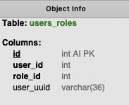
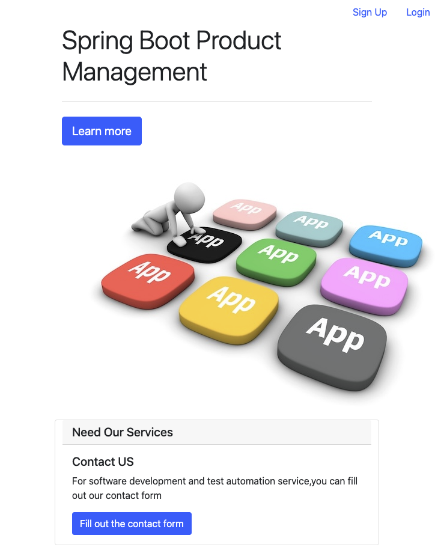

# Spring Boot Product Management Application
This application illustrate how to use Spring Boot MVC to design a secure web application
# YouTube Video about the Application

[Watch the Application Explanation Video on YouTube](https://youtu.be/Fs43poT_UX4)

### Application Functionalities
After successfully running the application on your local machine, you should be able to perform the following functionalities:

* Admin user should be able to create, edit, and delete products
* User should be able to sign up and create products
* Editor should be able to edit products
* Creator should be able to create products

### Spring Boot Tech Stack
 This application uses the following spring boot tech stack. 

* Spring Boot MVC
* Spring Data
* Spring Unit Test
* Spring Security

### Setup Application Locally

#### Spring Boot Product Management Application SETUP
To setup the application locally, you need to setup MySQL and prepare some data in advance.

#### Setup MySQL Locally
You can download and install MySQL Workbench on your local machine and create a database.
* [Download and Install MySQL Workbench](https://dev.mysql.com/doc/workbench/en/wb-installing.html)
* [Create MySQL Database using MySQL Workbench](https://dev.mysql.com/doc/workbench/en/wb-getting-started-tutorial-creating-a-model.html)

* product_management database schema should contain the following tables in the screenshot below. 


* product table 


* roles table


* users table


* users_roles table



* Insert the test data into the tables below
  * product - use the reference file [products_table_data.csv](setup-doc/product_table_data.csv)
  * roles - use the reference file [roles_table_data.csv](setup-doc/roles_table_data.csv)
  * users - use the reference file [users_table_data.csv](setup-doc/users_table_data.csv)
  * users_roles - use the reference file [users_roles_table_data.csv](setup-doc/users_roles_table_data.csv)

### Run Unit Test
 in the terminal, run the command below to execute the unit test

 ```
mvn clean install
```
The unit test should pass, and you should see BUILD SUCCESS on the terminal console. 


### Run The Application
Navigate to the root of the project via command line and execute the command

 ```
mvn spring-boot:run
```
The application should run successfully,and you should be able to use the application on your localhost . 
 ```
http://localhost:8089
```

